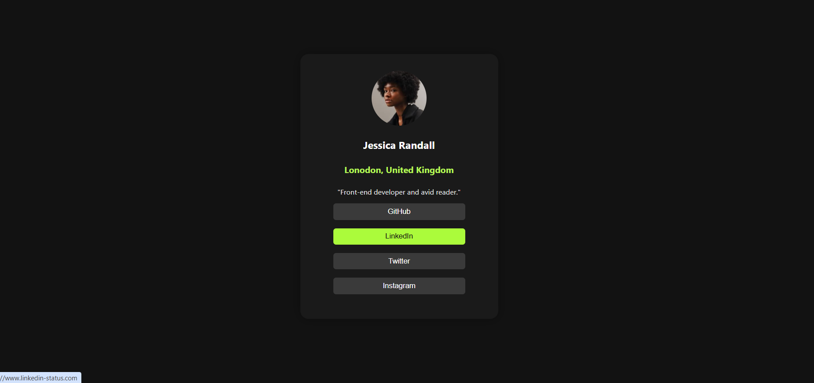

# Social links profile Challenge

## 🔍 Overview

This project demonstrates the use of modern CSS styling techniques to create a centered, responsive profile card UI. It is ideal for use in personal portfolios or as a practice project for mastering layout, flexbox, and card design.

## 🚀 Features

- Centered layout using Flexbox
- Dark-themed background
- Rounded card design with subtle box shadow
- Custom font for clean, modern typography
- Responsive structure (adapts to screen size)
